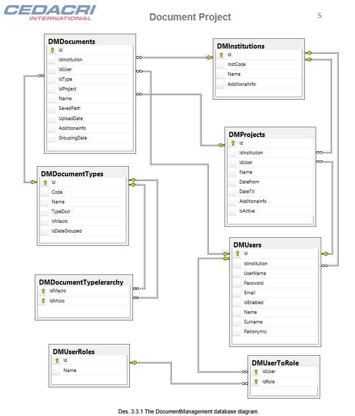
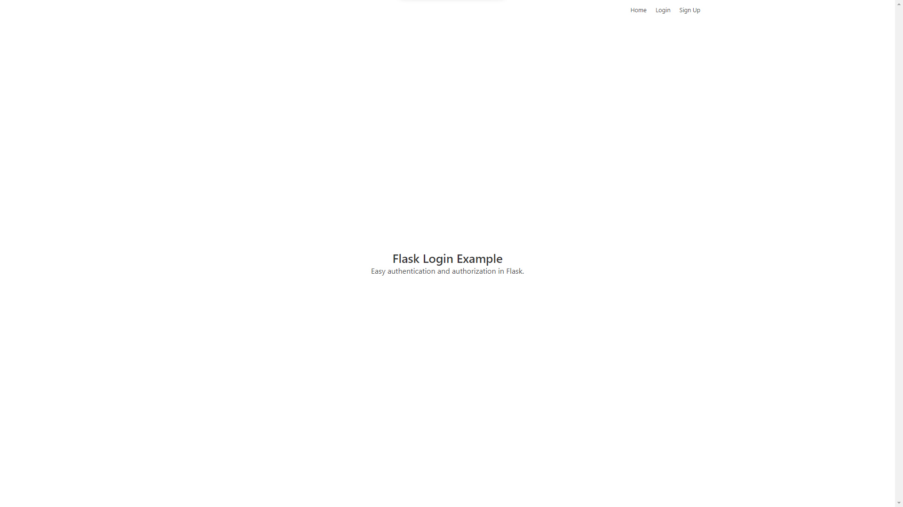
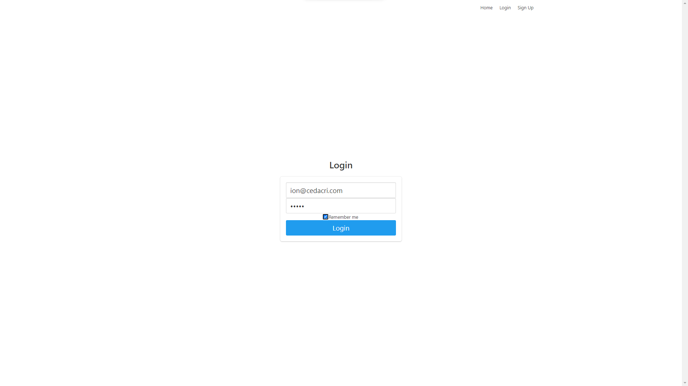
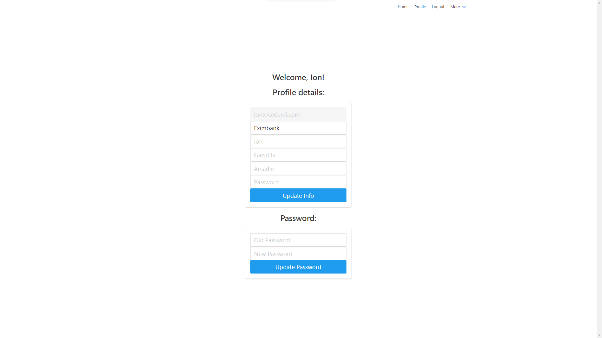
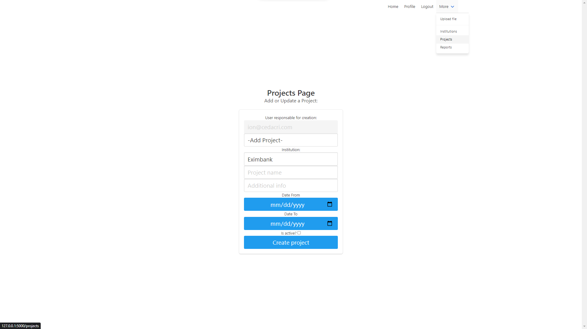
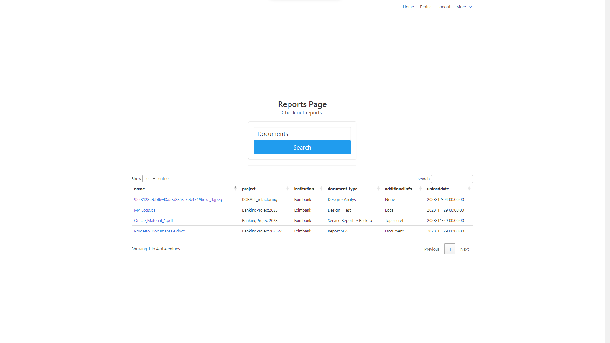
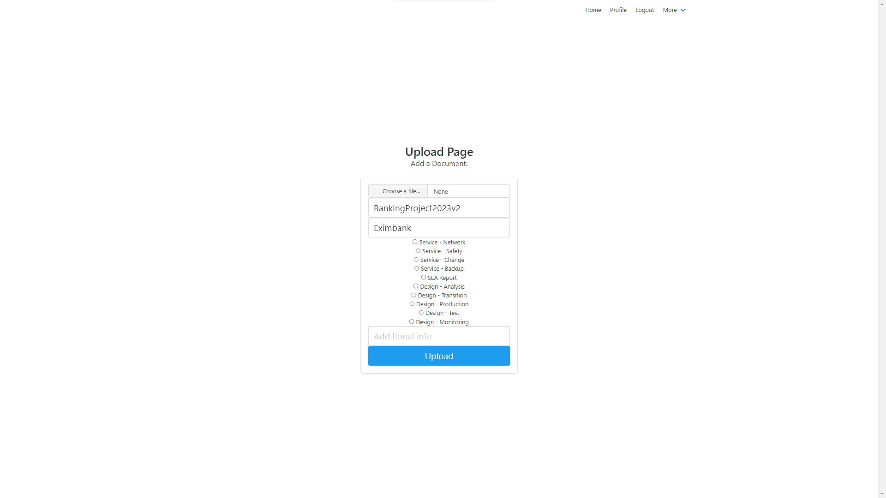

# Flask Document management system concept
This is an example app repository that uses **Flask** to model a wep application for uploading and downloading documents securely. Based on 

## Run:
1. `pip install -r requirements.txt` install dependencies
2. Somehow migrate an OracleDB instance from [models.py](project/models.py), or make the necessary changes to use your own db how you see fit. Was modeled after [Progretto_documentale](/Progetto_Documentale%20en.docx): 

3. `flask --app project run --debug` run the app

### Results:

